さわってわかるクラウド入門 AWS演習
==
###### v23.07.03.1
## ハイブリッドクラウド版

# 概要
- AWS環境上にWebサーバを配置し、オンプレミスのリレーショナルデータベース（RDB)を利用する、ハイブリッドクラウド構成のWebアプリケーションを構築します
- EC2でのWebサーバの作成と、SSHトンネルを利用したハイブリッドクラウド構築を体験できます。ネットワークやSSHトンネルはすでに作成済みのため、すぐにサーバ構築に取り掛かることができます
- 演習が完了すると、以下の構成が出来上がります。受講者様PCのWebブラウザからEC2インスタンスに接続し、Webアプリケーションの動作確認を実施します
    > オンプレミス側のデータベースなどの構成は、すでに構築済みのため演習手順には含まれません



- 所要時間は約30分です
# この演習で学べること
- AWSマネージメントコンソールの基本的な使い方
- セキュリティグループの設定方法
- 検証環境向けのEC2インスタンスの構築方法
# 演習の前にお読みください
- マネージメントコンソールへのログインURL、ユーザー名、パスワードは受講当日に講師から伝えられます
- マネージメントコンソールへの文字入力は、必ず半角英数字でのみ行ってください
- 手順中に設定の指示がない場合は、画面上での値の入力や変更は不要です。次の手順に進んでください
- 設定値を入力する場合は、できるだけコピペしてください。手入力は記載ミスの恐れがあります
- 演習手順について講師に確認する場合は、項目の番号をお伝え下さい。例：2-3の手順5番
## 凡例
- 手順書内での凡例は以下の通りです。ご活用ください
    - 補足
    > 作業手順の補足事項を記載しています
    - 予備知識
    :::tip
    予備知識を記載しています
    :::
    - 注意 
    :::warning
    主に、作業ミスの起きやすいポイントや注意事項を記載しています
    :::
    - 動作不良等
    :::danger
    うまく動作しないときに確認するポイントを記載しています。講師に確認する際に、ご自分でもチェックしてみてください
    :::
# 演習環境の有効期限等について
- 演習環境の有効期限は、講義当日の20時までです。20時以降になると、パスワードが変更され利用できなくなります
- 演習で作成したEC2及びRDSの各インスタンスは、20時になると自動で削除されますのでご了承ください
- 講義終了後の演習環境でのログインは、上記時間までご自由に実施ください。演習を再度実行したい場合は、作成したEC2インスタンスやRDSインスタンスを削除してから実施してください
---
# 演習手順
## 1. AWSコンソールへのログイン
1. 講師から伝えられたログイン用のURLにWebブラウザでアクセスしてください。AWSのログイン画面が開きます
    > Zoomのチャットで配布された場合は、クリックするだけで画面が開きます
3. 講師から伝えられたユーザー名及びパスワードを入力して [サインイン] ボタンを押下してください

    ::: tip 
    ログイン直後の画面に**新しいAWSコンソールのホーム**というボックスが表示されることがあります。その場合は**新しいコンソールのホームに切り替える**というボタンを押してください。AWSのマネージメントコンソールは、ユーザーの要望を取り入れて日々進化しているため、このような表示が出ることがあります
    :::

4. マネージメントコンソールがブラウザ上に表示されます。AWSの世界へようこそ！
    > パスワードを保存するかを確認されることがありますが、どちらでも構いません。再ログインする可能性がある場合は、手間を省くために保存しても結構です
2. 画面右上に**東京**と表示されていることを確認してください。東京以外の表示になっている場合はその地名をクリックし、ドロップダウンボックスから**東京**を選択してください
## 2. セキュリティグループの作成
- ファイアーウォールの機能であるセキュリティグループを作成します。Webサーバ用とデータベースサーバ用の2つを作成します。まずはWebサーバ用のセキュリティグループから作成しましょう
- セキュリティグループはVPCに設定します。本来はVPCの作成から行う必要がありますが、この演習ではVPCはすでに作成済みの為、すぐにセキュリティグループを設定可能です
#### 手順
1. 画面左上の虫眼鏡アイコンのボックスに**EC2**と入力します（小文字でも可）。表示された一覧から**EC2**をクリックしてください
    > EC2という文字をクリックしてください。他の箇所はクリックしても反応しません
4. EC2のダッシュボードが表示されます。「おかえりなさい」という吹き出しが表示されることがありますが、無視してかまいません
5. 左側のメニューにて、**セキュリティグループ**をクリックしてください
6. 右上の [セキュリティグループの作成] ボタンを押下してください
7. 以下を設定します
    |項目|設定値
    |:--|:--
    |セキュリティグループ名|web-sg
    |説明|web server security group 
    |VPC|表示されているものを X で削除したのち、選択肢の中からLabVPCを選択

8. インバウンドルール欄の [ルールを追加] ボタンを押下してください
9. **カスタムTCP**をクリックし、**HTTP**を選択
10. ソース欄にある空白のボックスをクリックし、選択肢から**0.0.0.0/0**を選択
11. 右下の [セキュリティグループを作成] ボタンを押下してください
12. 作成したセキュリティグループの詳細画面に遷移します。時間に余裕があれば内容を確認してください

## 3. Webサーバ作成
- WebサーバとなるEC2インスタンスを起動します。Webサーバアプリケーションフレームワークには、Python製の flask を利用しています
- サーバアプリケーションの実行に必要なミドルウェアやアプリケーション本体は、ユーザーデータ（後述）を使ってインスタンス起動時に自動でインストールされるようにします。ですので簡単な設定だけでWebサーバが利用できます。
#### 手順 
### 3-1. EC2インスタンス作成
1. 画面左上の虫眼鏡アイコンのボックスに**EC2**と入力します（小文字でも可）。表示された一覧からEC2をクリックしてください。EC2のダッシュボードが表示されます
    > 最初の作業でセキュリティグループの作成を行っているので、セキュリティグループの画面が表示されるかもしれませんが、気にせず先の手順に進んでください
1. 左側メニューで、**インスタンス**をクリックしてください
    > 先頭に三角のアイコンの付いていない方をクリックしてください
2. 画面右上にある [インスタンスを起動] ボタンを押下してください。インスタンスを起動するための画面に遷移します

    :::tip
    EC2インスタンスを作成することを、「起動」と言います。また、「シャットダウン」はEC2インスタンスの削除を意味します
    :::

1. **名前とタグ**のボックスに、インスタンスの名前を設定します。ボックスに websv と入力したら、次に進んでください
2. 起動するOSを確認します。以下を確認してください
   - **説明**の下に、**Amazon Linux 2 Kernel 5.10 AMI 2.0.20220912.1 x86_64 HVM gp2** とあること
   > 20220912 の部分は違う表記でも問題ありません

   - **アーキテクチャ**が、 **64ビット (x86)** になっていること

3. もし表記が上記と異なっている場合は、**Amazonマシンイメージ（AMI)** のドロップダウンボックスから、上記の 説明 の状態になるものを選択してください
6. 次にインスタンスタイプ、つまりインスタンスのスペックを確認します。インスタンスタイプの下の表記が **t2.micro** であることを確認してください。もし異なる場合は、ドロップダウンボックスから t2.micro を選択してください
7.  次のキーペアは今回は利用しません。ドロップダウンボックスから、 **キーペアなしで続行** を選択してください
    :::tip
    キーペアは、インスタンスにSSHログインするための認証鍵です。今回はSSHではない方法でインスタンスにログインするので不要です
    :::

8. 次はネットワークの設定を行います。右にある [編集] ボタンを押して、以下を設定してください

    |項目|設定値
    |:--|:--
    |VPC|LabVPC
    |サブネット|PublicSubnet
    |パブリックIPの自動割り当て|有効化<br>※自動で設定されているはずですが、ご確認ください
    |ファイアーウォール（セキュリティグループ）|既存のセキュリティグループを選択する を選択したあと、<br>共通のセキュリティグループにて web-sg を選択

    :::warning
    次に進む前に、以下をよく確認してください<br>
    - サブネットの選択で、**PublicSubnet** を選択しているか<br>
    - セキュリティグループで、**web-sg** を選択しているか
    :::

9. ストレージを設定 は変更不要です。そのまま先に進んでください

10. 高度な詳細 を2か所設定します（指示のない場所は変更不要です）。もし、高度な詳細のメニューが開かれていない場合は、頭にある▼をクリックして展開してください

11. IAMインスタンスプロフィール のドロップダウンボックスから **Ec2DefaultRole** を選択してください

12. **ユーザーデータ**が表示されるまで下にスクロールし、ボックスに以下の全ての行をコピペしてください
    ```shell
    #!/bin/sh
    sudo yum install -y python3 python3-pip git mariadb
    sudo pip3 install flask pymysql python-dotenv
    git clone https://github.com/trainocate-japan/sawakura-labs.git /home/ec2-user/sawakura-labs
    sudo chown -r ec2-user:ec2-user /home/ec2-user/
    ```
    ::: tip
    ユーザーデータは、EC2インスタンスの起動時にスクリプトを自動で実行してくれる機能です。
    ミドルウェアのアップデートなどOSのインストール後に必ず実行する処理や、アプリケーションのインストール作業などを自動化することができます
    :::

23. これで設定は完了です。[インスタンスの起動] ボタンを押下してください。画面が遷移し、情報が表示されます。[インスタンスの表示] ボタンを押下してください
24. インスタンスの状態が **保留中**から**実行中**に変わるまでお待ちください（通常数秒で変わります）
    > 保留中という表記は pending と表示されることもあります。同じく、実行中の表記は running と表示されることがあります
25. インスタンスの行をどこでもよいのでクリックしてください。画面下半分にインスタンスの情報が表示されます 
26. 右の列に**パブリックIPv4 DNS**という記載があるので、そのFQDNをテキストエディタ等にコピペして保管してください

    :::tip
    ホスト名の左にある四角いアイコンをクリックするとコピーできます
    :::

27. 上記で記録したFQDNを講師に伝えてください。Zoomチャットなど、講師から指示された方法で伝えましょう

    :::tip
    SSHトンネルを構成するEC2インスタンスはパブリックサブネットにあるため、皆様のWebアプリケーションが稼働するEC2インスタンスのパブリックアドレスをセキュリティグループで制御しています。アドレスを登録する必要があるので、講師に伝えて頂きます
    :::

### 3-2. EC2インスタンスのシェルへログイン
- Webアプリケーションを起動するためにシェルにログインします。通常はTeratermなどでSSH接続 しますが、今回はAWSマネージメントコンソールから直接インスタンスのシェルにログイン可能な、SessionManagerという機能を使います
#### 手順 

::: warning
以降、コピペの作業が発生しますので、ペーストのミスがないか注意しながら進めてください。また、Ctrl-Vでのペーストができない場合は、マウスの右クリックメニューからのペーストなどを試してみてください
:::

1. 画面左上の虫眼鏡アイコンのボックスに**EC2**と入力します（小文字でも可）。表示されたメニューの**EC2**をクリックします
1. インスタンス一覧に、先程起動したEC2インスタンスが表示されます。インスタンスの行をどこでもよいので右クリックしてメニューを表示し、**接続**を選択してください
1. インスタンスに接続 という画面に切り替わります。**セッションマネージャー**というタブをクリックしてください

    ::: warning
    セッションマネージャーの他に、EC2 Instance Connectなどのタブも並んでいます。間違えないようにご注意ください
    :::

2. 右下の[接続]ボタンが**オレンジ色で表示されること**を確認してください。オレンジ色で表示されていれば、[接続]を押下してください

    :::danger
    接続ボタンがオレンジ色にならない場合は以下を確認してください
    - web-sgセキュリティグループのアウトバウンドに0.0.0.0/0が設定されているか（デフォルトで設定されていますが、まれに作業ミスで削除や変更してしまうケースがあります）
    - EC2インスタンスのIAMロールに**Ec2DefaultRole**が設定されているか
    :::

3. 接続ボタンを押下すると、しばらくしてインスタンスのシェルに接続され、Linuxコマンドが実行可能な状態になります。**sh-4.2$** と表示されるまで、少しお待ち下さい 
4. Webアプリケーションの配置されているLinuxユーザーに切り替えます。次のコマンドを実行してください
    > sh-4.2$  の後にコピー＆ペーストしてからEnterキー、で実行できます

    ```shell
    sudo su - ec2-user
    ```
5. **[ec2-user@ip-X-X-X-X]$** と表示されれば問題ありません。次に進んでください
5. 続けて、Webアプリケーションの配置されたディレクトリに移動します。次のコマンドを実行してください
    ```shell
    cd sawakura-labs
    ```

:::tip
EC2インスタンスを起動するときに設定したユーザーデータにより、Webアプリケーション一式がsawakura-labsというディレクトリにダウンロードされています。時間に余裕があれば、ディレクトリの中身を見てみてください
:::

### 3-3. オンプレミスとの接続準備
- オンプレミスにあるデータベースと Webアプリケーションを接続するための準備を行います
- クラウドとオンプレミスとの接続は、一般的にはVPNや専用線が用いられますが、今回はオンプレミスからAWSにSSHトンネル接続することで実現しています
- SSHトンネルについて詳しく知りたい場合は、講師に確認してください
#### 手順
1. vi で .env ファイルを編集し保存してください。編集箇所は以下の通りです。なお、labdbX の X を何にするかは講師からの指示に従ってください
    |変更前|変更後
    |:--|:--
    |db_name = "labdb" | db_name = "labdbX"
    |db_user = "admin" | db_user = "root"
1. vi で app.pyを編集し保存してください。以下の関数に、ハイライトされている行 (port=33306,) を追加するだけです
    ```python{4}
     def get_connection(dbhost):
        conn = pymysql.connect(
            host=dbhost,
            port=33306,
            db=os.getenv("db_name"),
            user=os.getenv("db_user"),
            password=os.getenv("db_password"),
            charset="utf8",
            cursorclass=pymysql.cursors.DictCursor,
        )
        return conn
    ```

## 4. Webアプリケーションの実行と動作確認
- いよいよアプリケーションを実行します。アプリケーションはユーザーデータを使ってインストール済みなため、データベースの設定を行うだけで実行できます
#### 手順 
1. 先程の作業に続けて、以下のコマンドを実行してください。これでWebアプリケーションが起動します 
    ``` shell
   sudo python3 app.py
    ```
7.  問題なく起動すると、以下のようなメッセージが表示され、Webブラウザからのアクセスを受け付けられる状態になります（表示内容は環境により異なります）
    ```shell
    * Serving Flask app 'app' (lazy loading)
    * Environment: production
    WARNING: This is a development server. Do not use it in a production deployment.
    Use a production WSGI server instead.
    * Debug mode: off
    * Running on all addresses.
    WARNING: This is a development server. Do not use it in a production deployment.
    * Running on http://10.0.1.xx:80/ (Press CTRL+C to quit)
    ``` 
8.  ブラウザで新たに別のタブを開いてください。テキストエディタ等に保管しておいたEC2インスタンスのホスト名（パブリックIPv4 DNS）をブラウザのURL欄にペーストして、Enterキーを押下してください

    ::: warning
    パブリックIPv4 DNS は、ec2-xxx-xxx-xxx-xxx.ap-northeast-1.compute.amazonaws.comのような文字列です。データベースのホスト名と間違えないようにご注意ください
    :::

9.  Webアプリケーションが動作し、**データベースホスト設定**というページが表示されるはずです

    ::: danger
    ページが表示されない場合は、以下が原因の可能性が高いです。確認してみましょう
    - セキュリティグループ web-sg の設定間違い（ソースアドレスや、誤ってアウトバウンド側を設定変更していた、など）
    - ブラウザに貼り付けたURLのコピペミス
    - HTTPSで接続している
    - EC2インスタンスがパブリックサブネットで起動していない
    :::

10. 講師から伝えられているSSHトンネル用インスタンスのアドレスを入力し、[設定]ボタンを押下してください 

11. ここまでの手順が問題なければ、弊社のクラウドコース一覧が表示されるはずです（ぜひ、今後ともご贔屓にお願い致します！）。このコース情報はデータベースに保管されているものです。

12. 以上で演習は終了です。お疲れさまでした！ 

::: tip 
SSHトンネル用インスタンスは講師の管理する VPC のバプリックサブネットに存在しています。このインスタンスの33306/tcpに着信したパケットは、オンプレミス側のデータベースの3306/tcpに転送するようにSSH接続されています。以下のコマンドでオンプレミス側からSSH接続することで実現しています
<br>
    ```
    ssh -R 0.0.0.0:33306:データベースサーバのIPアドレス:3306 SSHトンネル用インスタンスのアドレス
    ```
<br>
この機能は、オンプレミス側のFW等でAWSからの接続を許可する必要がないためセキュアな接続を実現できます
:::

# おわりに
- お疲れ様でした！AWSの演習はいかがだったでしょうか？
- もしよろしければ、Zoomチャットなどで演習の感想を聞かせてください！
